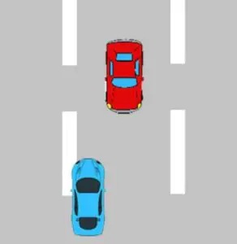
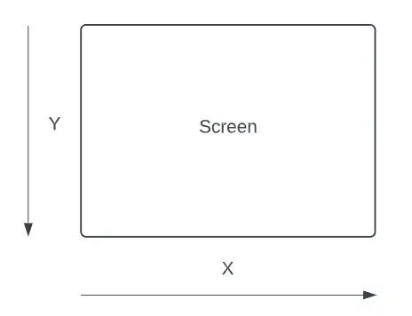

# Obstacle game

Build your first "Avoid Obstacle" game in python

- [Obstacle game](#obstacle-game)
  - [What we will build?](#what-we-will-build)
  - [Do we need any tool to build it?](#do-we-need-any-tool-to-build-it)
  - [How we will build?](#how-we-will-build)
    - [Setting up game](#setting-up-game)
    - [The Game Loop](#the-game-loop)
      - [Quitting the Game loop](#quitting-the-game-loop)
    - [Event Objects in Pygame](#event-objects-in-pygame)
    - [Creating a Display Screen](#creating-a-display-screen)
    - [Pygame Colors](#pygame-colors)
    - [Frames per second](#frames-per-second)
    - [Rects \& Collision Detection in Pygame](#rects--collision-detection-in-pygame)
    - [Game Creation – Part#1](#game-creation--part1)
    - [Game Creation – Part#2](#game-creation--part2)
    - [Game Creation – Part#3](#game-creation--part3)
  - [Other Areas of Improvement](#other-areas-of-improvement)

## What we will build?

> We will build a games where you’re moving a character sideways to avoid the incoming obstacles. Short and Fun!

It will look something like this.


## Do we need any tool to build it?

We will use Pygame library of pyhton to build this game.

The Pygame library is probably the most well known python library when it comes to making games. Pygame serves as a great entry point into the world of graphics and game development, especially for beginners.

```python
# Install pygame
python -m pip install -U pygame --user
```

The Pygame framework includes several modules with functions for drawing graphics, playing sounds, handling mouse input, and other things that you’ll need while developing games in Python.

## How we will build?

### Setting up game

We’ll begin this Python tutorial by explaining several core concepts related to the Pygame library and about creating games in general. Also keep in mind, that many of these concepts are transferable skills. Should you switch to a more advanced game engine later many of these concepts will still hold true.

```python
import pygame
from pygame.locals import *
```

In the above code we begin importing pygame and it’s modules into our python program. The second line allows us to use the functions and variables in the pygame.locals module without having to add the lengthy pygame.locals prefix.

```python
pygame.init()
```

The init() function in pygame initializes the pygame engine. This line must be included before you begin writing any pygame code.

### The Game Loop

The Game Loop is where all the game events occur, update and get drawn to the screen. Once the initial setup and initialization of variables is out of the way, the Game Loop begins where the program keeps looping over and over until an event of type QUIT occurs.

Shown below is what a typical Game loop in Pygame looks like. Despite the fancy, it is just a simple “while” loop that runs infinitely.

```python
#Game loop begins
while True:
      # Code
      # More Code
      .
      .
      pygame.display.update()
```

Changes in the game are not implemented until the pygame.display.update() function has been called. This function is responsible for updating your game window with any changes that have been made within that specific iteration of the game loop. It’s essential to place this within the game loop, to keep our display screen updated with the latest changes from every iteration.

We place it at the very end so that all possible changes to the Sprites on the screen have already taken place. We could call this more than once (e.g. every time we make a change in the game loop), but that would be more performance intensive and inefficient.

#### Quitting the Game loop

Every game loop must have a end point, or some action that triggers the end point (such as clicking the quit button), else your game will run indefinetly.

```python
while True:
    for event in pygame.event.get():
        if event.type == QUIT:
            pygame.quit()
            sys.exit()
    pygame.display.update()
```

We call both pygame.quit() and sys.exit() to close the pygame window and the python script respectively. Simply using sys.exit() can cause your IDE to hang due to a common bug. (Remember to import the sys library to use this function).

### Event Objects in Pygame

A Pygame “Event” occurs when the user performs a specific action, such as clicking his mouse or pressing a keyboard button. Pygame records each and every event that occurs. However, it won’t really do anything with this information because that part is upto us to do.

We can find out which events have happened by calling the pygame.event.get() function (shown previously), which returns a list of pygame.event.Event objects (which we will just call Event objects for short).

One of the many attributes (or properties) held by event objects is type. The type attribute tells us what kind of event the object represents.

```python
while True:
    for event in pygame.event.get():
        if event.type == QUIT:
            pygame.quit()
            sys.exit()
    pygame.display.update()
```

If you take a look at the example above again, you’ll see we used event.type == QUIT to determine whether the game was to be closed or not. We can even create our own custom events to signal certain types of events (such as an enemy spawning or a level up).

### Creating a Display Screen

For every game, we need to create a window of a fixed size by passing a tuple containing the width and height. This tuple is then passed into the display.set_mode() function.

```python
DISPLAYSURF = pygame.display.set_mode((300,300))
```

In pygame and other game libraries, we regard the (0, 0) coordinate as the top-left most corner. Similarly, the maximum x-point and maximum y-point is the bottom-right corner. Which in this case is (300, 300).

The X-values grow larger as you move left to right, and the Y-values grow larger from top to bottom.



You can also customize this window later by changing it’s title and the default icon.

### Pygame Colors

Colors are going to be a big part of any game development framework or engine, so you should understand it well.

Pygame uses the typical RGB system of colors. To those who aren’t aware, this stand for Red, Green and Blue respectively. These three colors combined (in varying ratios) are used to create all the colors you see on computers, or any device that has a screen.

The values for each color range from 0 – 255, a total of 256 values. You can find the total number of possible color combinations by evaluating 256 x 256 x 256, which results in a value well over 16 million.

In order to use colors on Pygame, we first create Color objects using RGB values. RGB values must be in a tuple format, with three values, each corresponding to a respective color.

```python
color1 = pygame.Color(0, 0, 0)         # Black
color2 = pygame.Color(255, 255, 255)   # White
color3 = pygame.Color(128, 128, 128)   # Grey
color4 = pygame.Color(255, 0, 0)       # Red
```

Shown above are examples of how we can create Colors. We will use these later on in our Pygame tutorial when we begin creating backgrounds or shapes.

### Frames per second

Computer’s are extremely fast and can complete millions of loop cycles in under a second. Now obviously, this is a little fast for us humans. As reference, movies are run at 24 frames per second. Anything less than that will have an obvious stutter to it, whereas values over 100 may cause the things to move too fast for us to see.

By default, if we do not create a limitation the computer will execute the game loop as many times as in can within a second. This is actually a major problem, because without a “limiter” the frame rate will fluctuate greatly throughout the game depending on what’s currently happening (number of objects on screen, player moving or not, etc.)

To limit it we use the tick(fps)method where fps is an integer. The tick() method belongs to the pygame.time.Clock class and must be used with an object of this class.

```python
FPS = pygame.time.Clock()
FPS.tick(60)
```

This can vary from game to game, depending on how it was designed but you should aim for a value between 30 – 60. Keep in mind, that if you create a rather complex and heavy game the computer might not be able to run it well at higher frames.

### Rects & Collision Detection in Pygame

In every game, each object has fixed boundaries that define the space that it currently occupies. These fixed boundaries are essential when the object interacts or “collides” with other objects.

By defining these boundaries, the game is able to detect when two or more boundaries overlap or touch. This allows it to then handle the interact based on which objects are touching. Such as the Player picking up an item, or attacking another entity.


Pygame rect example
Shown in the image above is a typical “rect” object (colored in black) around a Car. It’s not 100% accurate, as it does not full take on the shape of the Car but it is accurate enough for most purposes.

To check for collisions, we have various methods and functions, each used for a slightly different purpose. For example the below code is used to check for collisions between two Rects. (Can you guess whether it will return True or False?)

```python
object1 = pygame.Rect((20, 50), (50, 100))
object2 = pygame.Rect((10, 10), (100, 100))
 
print(object1.colliderect(object2))
```

We can also check for a collision between a Rect and a pair of coordinates.

```python
object1 = pygame.Rect((20, 50), (50, 100))
 
print(object1.collidepoint(50, 75))
```

There is another trick we can use to automatically create a Rect based off an image’s dimensions. We will explore this later on in this Pygame tutorial, when we create our game.

### Game Creation – Part#1

Time to begin the second half our Python Pygame Tutorial. We’ve discussed some basic concepts and code, now lets explore how we can use this information to make a proper game.

Whether it’s GUI, Pygame or any other large application, the Classes approach (OOP) is almost always the best idea (Unless you have a really simple and small program). Using Classes, we’ll be using methods to store blocks of code that are to be repeated several times throughout the game. An object of each Class will represent an entity in our game (such as an Enemy, or the Player).

Although our game will only have one Enemy and one Player, this may not always be the case. We may expand this game later by adding more enemies, in which case all we would have to do, is create a new enemy object from our Enemy Class.

Below is the initial version of our game. It’s not yet complete, but the foundation has been set.

``` python
import pygame, sys
from pygame.locals import *
import random
 
pygame.init()
 
FPS = 60
FramePerSec = pygame.time.Clock()
 
# Predefined some colors
BLUE  = (0, 0, 255)
RED   = (255, 0, 0)
GREEN = (0, 255, 0)
BLACK = (0, 0, 0)
WHITE = (255, 255, 255)
 
# Screen information
SCREEN_WIDTH = 400
SCREEN_HEIGHT = 600
 
DISPLAYSURF = pygame.display.set_mode((400,600))
DISPLAYSURF.fill(WHITE)
pygame.display.set_caption("Game")
 
 
class Enemy(pygame.sprite.Sprite):
      def __init__(self):
        super().__init__() 
        self.image = pygame.image.load("Enemy.png")
        self.rect = self.image.get_rect()
        self.rect.center=(random.randint(40,SCREEN_WIDTH-40),0) 
 
      def move(self):
        self.rect.move_ip(0,10)
        if (self.rect.bottom > 600):
            self.rect.top = 0
            self.rect.center = (random.randint(30, 370), 0)
 
      def draw(self, surface):
        surface.blit(self.image, self.rect) 
 
 
class Player(pygame.sprite.Sprite):
    def __init__(self):
        super().__init__() 
        self.image = pygame.image.load("Player.png")
        self.rect = self.image.get_rect()
        self.rect.center = (160, 520)
 
    def update(self):
        pressed_keys = pygame.key.get_pressed()
       #if pressed_keys[K_UP]:
            #self.rect.move_ip(0, -5)
       #if pressed_keys[K_DOWN]:
            #self.rect.move_ip(0,5)
         
        if self.rect.left > 0:
              if pressed_keys[K_LEFT]:
                  self.rect.move_ip(-5, 0)
        if self.rect.right < SCREEN_WIDTH:        
              if pressed_keys[K_RIGHT]:
                  self.rect.move_ip(5, 0)
 
    def draw(self, surface):
        surface.blit(self.image, self.rect)     
 
         
P1 = Player()
E1 = Enemy()
 
while True:     
    for event in pygame.event.get():              
        if event.type == QUIT:
            pygame.quit()
            sys.exit()
    P1.update()
    E1.move()
     
    DISPLAYSURF.fill(WHITE)
    P1.draw(DISPLAYSURF)
    E1.draw(DISPLAYSURF)
         
    pygame.display.update()
    FramePerSec.tick(FPS)
```

### Game Creation – Part#2

Our game is still pretty incomplete. There’s no fun in playing a game with the same thing happening over and over again. There is no end point, no variation in the game difficulty and most importantly, there are no consequences of colliding with the enemy.

In this section we’re going to cover Sprite Grouping, Collision Detection, User events and some other minor features.

Here’s the Code Version 2. We’ve made several additions, changed several lines and even removed some lines. Take a good look at the code before moving on.

```python
#Imports
import pygame, sys
from pygame.locals import *
import random, time
 
#Initializing 
pygame.init()
 
#Setting up FPS 
FPS = 60
FramePerSec = pygame.time.Clock()
 
#Creating colors
BLUE  = (0, 0, 255)
RED   = (255, 0, 0)
GREEN = (0, 255, 0)
BLACK = (0, 0, 0)
WHITE = (255, 255, 255)
 
#Other Variables for use in the program
SCREEN_WIDTH = 400
SCREEN_HEIGHT = 600
SPEED = 5
 
#Create a white screen 
DISPLAYSURF = pygame.display.set_mode((SCREEN_WIDTH,SCREEN_HEIGHT))
DISPLAYSURF.fill(WHITE)
pygame.display.set_caption("Game")
 
 
 
class Enemy(pygame.sprite.Sprite):
      def __init__(self):
        super().__init__() 
        self.image = pygame.image.load("Enemy.png")
        self.rect = self.image.get_rect()
        self.rect.center = (random.randint(40,SCREEN_WIDTH-40), 0)    
 
      def move(self):
        self.rect.move_ip(0,SPEED)
        if (self.rect.top > 600):
            self.rect.top = 0
            self.rect.center = (random.randint(30, 370), 0)
 
 
class Player(pygame.sprite.Sprite):
    def __init__(self):
        super().__init__() 
        self.image = pygame.image.load("Player.png")
        self.rect = self.image.get_rect()
        self.rect.center = (160, 520)
        
    def move(self):
        pressed_keys = pygame.key.get_pressed()
       #if pressed_keys[K_UP]:
            #self.rect.move_ip(0, -5)
       #if pressed_keys[K_DOWN]:
            #self.rect.move_ip(0,5)
         
        if self.rect.left > 0:
              if pressed_keys[K_LEFT]:
                  self.rect.move_ip(-5, 0)
        if self.rect.right < SCREEN_WIDTH:        
              if pressed_keys[K_RIGHT]:
                  self.rect.move_ip(5, 0)
 
#Setting up Sprites        
P1 = Player()
E1 = Enemy()
 
#Creating Sprites Groups
enemies = pygame.sprite.Group()
enemies.add(E1)
all_sprites = pygame.sprite.Group()
all_sprites.add(P1)
all_sprites.add(E1)
 
#Adding a new User event 
INC_SPEED = pygame.USEREVENT + 1
pygame.time.set_timer(INC_SPEED, 1000)
 
#Game Loop
while True:
       
    #Cycles through all events occuring  
    for event in pygame.event.get():
        if event.type == INC_SPEED:
              SPEED += 2
           
        if event.type == QUIT:
            pygame.quit()
            sys.exit()
 
 
    DISPLAYSURF.fill(WHITE)
 
    #Moves and Re-draws all Sprites
    for entity in all_sprites:
        DISPLAYSURF.blit(entity.image, entity.rect)
        entity.move()
 
    #To be run if collision occurs between Player and Enemy
    if pygame.sprite.spritecollideany(P1, enemies):
          DISPLAYSURF.fill(RED)
          pygame.display.update()
          for entity in all_sprites:
                entity.kill() 
          time.sleep(2)
          pygame.quit()
          sys.exit()        
         
    pygame.display.update()
    FramePerSec.tick(FPS)
```

That’s alot of code, but considering the average game created in Python pygame, it’s still very small. We’ll now proceed to discuss all the new changes and additions, block by block.

### Game Creation – Part#3

This is a bit of an additional, and also optional section in our Python Pygame tutorial. In this section, we’re going to cover backgrounds, sound, fonts and a scoring system. These are all important features one needs in a game, to make it a complete product.

As usual, take a good look at the code below before proceeding to the block

```python
#Imports
import pygame, sys
from pygame.locals import *
import random, time

#Initialzing 
pygame.init()

#Setting up FPS 
FPS = 60
FramePerSec = pygame.time.Clock()

#Creating colors
BLUE  = (0, 0, 255)
RED   = (255, 0, 0)
GREEN = (0, 255, 0)
BLACK = (0, 0, 0)
WHITE = (255, 255, 255)

#Other Variables for use in the program
SCREEN_WIDTH = 400
SCREEN_HEIGHT = 600
SPEED = 5
SCORE = 0

#Setting up Fonts
font = pygame.font.SysFont("Verdana", 60)
font_small = pygame.font.SysFont("Verdana", 20)
game_over = font.render("Game Over", True, BLACK)

background = pygame.image.load("AnimatedStreet.png")

#Create a white screen 
DISPLAYSURF = pygame.display.set_mode((400,600))
DISPLAYSURF.fill(WHITE)
pygame.display.set_caption("Game")

class Enemy(pygame.sprite.Sprite):
      def __init__(self):
        super().__init__() 
        self.image = pygame.image.load("Enemy.png")
        self.rect = self.image.get_rect()
        self.rect.center = (random.randint(40, SCREEN_WIDTH-40), 0)  

      def move(self):
        global SCORE
        self.rect.move_ip(0,SPEED)
        if (self.rect.top > 600):
            SCORE += 1
            self.rect.top = 0
            self.rect.center = (random.randint(40, SCREEN_WIDTH - 40), 0)


class Player(pygame.sprite.Sprite):
    def __init__(self):
        super().__init__() 
        self.image = pygame.image.load("Player.png")
        self.rect = self.image.get_rect()
        self.rect.center = (160, 520)
       
    def move(self):
        pressed_keys = pygame.key.get_pressed()
       #if pressed_keys[K_UP]:
            #self.rect.move_ip(0, -5)
       #if pressed_keys[K_DOWN]:
            #self.rect.move_ip(0,5)
        
        if self.rect.left > 0:
              if pressed_keys[K_LEFT]:
                  self.rect.move_ip(-5, 0)
        if self.rect.right < SCREEN_WIDTH:        
              if pressed_keys[K_RIGHT]:
                  self.rect.move_ip(5, 0)
                  
#Setting up Sprites        
P1 = Player()
E1 = Enemy()

#Creating Sprites Groups
enemies = pygame.sprite.Group()
enemies.add(E1)
all_sprites = pygame.sprite.Group()
all_sprites.add(P1)
all_sprites.add(E1)

#Adding a new User event 
INC_SPEED = pygame.USEREVENT + 1
pygame.time.set_timer(INC_SPEED, 1000)

#Game Loop
while True:
      
    #Cycles through all events occurring  
    for event in pygame.event.get():
        if event.type == INC_SPEED:
              SPEED += 0.5      
        if event.type == QUIT:
            pygame.quit()
            sys.exit()

    DISPLAYSURF.blit(background, (0,0))
    scores = font_small.render(str(SCORE), True, BLACK)
    DISPLAYSURF.blit(scores, (10,10))

    #Moves and Re-draws all Sprites
    for entity in all_sprites:
        DISPLAYSURF.blit(entity.image, entity.rect)
        entity.move()

    #To be run if collision occurs between Player and Enemy
    if pygame.sprite.spritecollideany(P1, enemies):
          pygame.mixer.Sound('crash.wav').play()
          time.sleep(0.5)
                   
          DISPLAYSURF.fill(RED)
          DISPLAYSURF.blit(game_over, (30,250))
          
          pygame.display.update()
          for entity in all_sprites:
                entity.kill() 
          time.sleep(2)
          pygame.quit()
          sys.exit()        
        
    pygame.display.update()
    FramePerSec.tick(FPS)
```

## Other Areas of Improvement

Now obviously, we could have gone alot further with this game. But we’ll stop here and just leave some ideas for you guys to practice and implement on your own.

- Multiple enemies spawning after set periods of time. (Similar to how we increased speed after a set period of time)
- Adding some additional audio to the game, such as background music and movement sounds (audio that plays when you move the character)
- Adding the concept of multiple Lives or a Health bar.
- Variations in the shape and size of the “enemies”.
